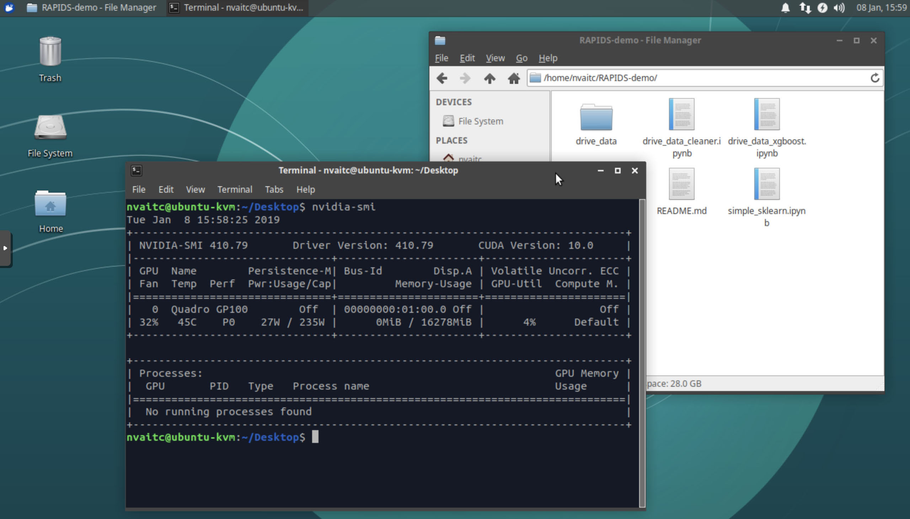
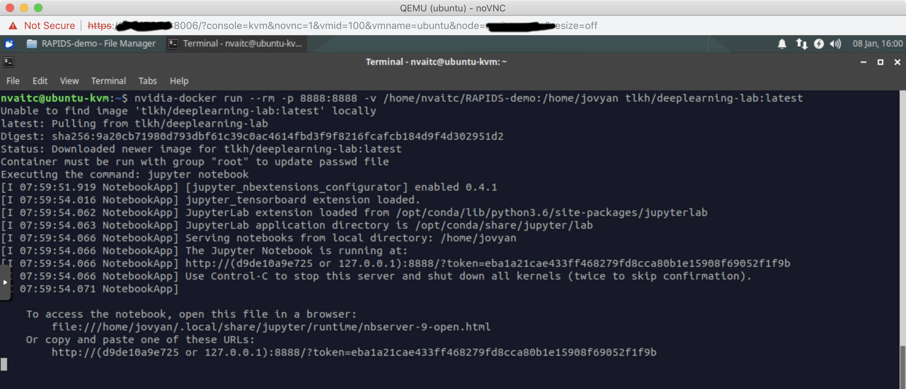
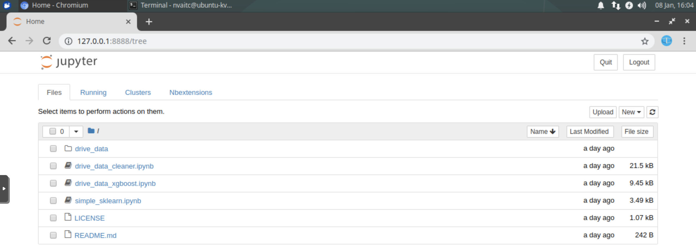
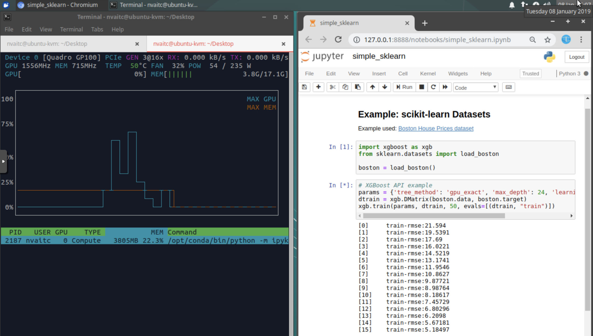

## Detailed Usage Instructions

This page will give a brief walkthrough on using this image.

To begin, please pull the latest version of the image with:

```
docker pull tlkh/deeplearning-lab:latest
```

Here, we are demonstrating the usage of the container with a freshly installed Ubuntu 18.04 VM with the lightweight XFCE environment. The instructions will apply to any other derivative of Ubuntu 16.04 or Ubuntu 18.04.

Note: You will need to have CUDA, Nvidia drivers, Docker and nvidia-docker2 runtime installed. For a quick and dirty way to ensure this, run the following (no warranty provided, but I use this myself)

```
sudo su root
apt install curl -y
curl https://getcuda.ml/ubuntu.sh | bash
# your system will reboot by itself
# find out more @ getcuda.ml
```

### 0. Interactive shell

```
nvidia-docker run -it tlkh/deeplearning-lab:latest bash
```

### 1. Deep Learning

```
TODO

basically just launch the docker container, connect to jupyter and use as per normal

nvidia-docker run --rm -p 8888:8888 -v /home/USER/FOLDER:/home/jovyan tlkh/deeplearning-lab:latest
# see breakdown of command detailed in next section
```

### 2. RAPIDS

#### Setup

1. `git clone https://github.com/tlkh/RAPIDS-demo`
2. You should have the following files and work from a workstation with CUDA and drivers already installed.



The dataset (`drive_data`) can be downloaded from [Google Drive](https://drive.google.com/file/d/1VFyqGKVVI4t15Xp9zdFdk7068IZYxn84/view?usp=sharing).

#### Running the sample

Launch the container with the working directory as the `RAPIDS-demo` folder using the following command:

```
nvidia-docker run --rm -p 8888:8888 -v /home/nvaitc/RAPIDS-demo:/home/jovyan tlkh/deeplearning-lab:latest
```

**Here is a breakdown of the command**

* Base command: `nvidia-docker run tlkh/deeplearning-lab:latest`
* `--rm` flag: remove after container stop
* `-p 8888:8888` : map port 8888 on container to 8888 on host
* `-v /home/nvaitc/RAPIDS-demo:/home/jovyan` : map folder `/home/nvaitc/RAPIDS-demo` on host to working directory of the container (`/home/jovyan`). Please note that **absolute paths** must be used.

The Jupyter environment will start automatically. You will see the following output. The last line tells you how to access the Jupyter environment from your browser.



When you access the URL, you should be able to see the following screen:



You can run the sample notebook `simple_sklearn.ipynb` to do a quick test and observe if the GPU is working properly. You may use `nvidia-smi` or `nvtop` ([install instructions](https://github.com/Syllo/nvtop/blob/master/README.markdown))


